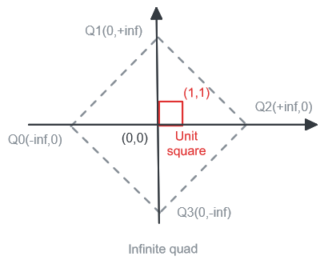

<div align="center">

# Constrained Delaunay Triangulation

[](https://crates.io/crates/ghx_constrained_delaunay)
[](https://docs.rs/ghx_constrained_delaunay)

</div>

A fast Rust library for 2D constrained Delaunay triangulation

# Examples

- Delaunay triangulation on a simple square
    ```
    cd examples
    cargo run --example dt
    ```
- Constrained Delaunay triangulation on a small figure
    ```
    cd examples
    cargo run --example cdt
    ```
- Constrained Delaunay triangulation on coastlines datasets
    ```
    cd examples
    cargo run --release --example cdt_real_data
    ```
  The loaded dataset is specified in the example sources:
    - **ne_50m_coastline**: 60416 vertices, 58987 constraint edges
    - **ne_10m_coastline**: 410957 vertices, 406824 constraint edges
    - **Europe_coastline**: 2912812 vertices, 2837094 constraint edges
- Constrained Delaunay triangulation on the video "Bad Apple"
    ```
    cd examples
    cargo run --release --example bad_apple
    ```
  The loaded frames are specified in the example sources. The frames data was generated using a custom [tool](https://github.com/Henauxg/bitmaps_to_triangulation_data).
  
  See the results with the full video here: https://www.youtube.com/watch?v=TrfDkD_PprQ

All examples use `Bevy` to visualize & explore the resulting triangulation.

https://github.com/Henauxg/ghx_constrained_delaunay/assets/19689618/fe30023b-da80-471f-bf6e-a978ab8e0ea2

### Additional examples assets

Some assets used by the examples are not included directly in the repository because of their weight but are stored in a git submodule [assets/heavy](https://github.com/Henauxg/cdt_assets/tree/main).

To download them just pull the submodule with:
 ```
 git submodule update --init --recursive
 ```

# Benchmarks

See [benchmarks](benchmarks/README.md)

# Implementation

Implementation is based on *"A fast algorithm for generating constrained delaunay triangulations"* by S. W. Sloan (1993). It was chosen because the path from DT (*Delaunay Triangulation*) to CDT (*Constrained Delaunay Triangulation*) seemed quite straight-forward. However some modifications were made to the original algorithm.

A few definitions, used to clarify the explanations:
  - **Super triangle**: an artificial triangle, first inserted in the triangulation, supposed to contain all the vertices to triangulate **(*)**, and removed before returning the triangulation result.
  - **Infinite triangle**: an evolution of the super triangle, with symbolic vertices located at infinite positions.
  - **Infinite quad**: an evolution of the infinite triangle with 4 infinite vertices.
  - **Super/infinite vertex**: one of the vertices of a super/infinite triangle.
  - **Pseudo super/infinite triangle**: a triangle with at least 1 super/infinite vertex among it's 3 vertices.
  - **Finite vertex**: any vertex given as an input to the algorithm.
  - **Semi infinite edge**: edge with 1 finite vertex and 1 infinite vertex
  - **Infinite edge**: edge with 2 infinite vertices
  - **Quad**: triangle pair sharing a common edge

**(*)** To be more correct, it should contain all the possible circumcircles of all the possible triangles in the triangulation.

## Modifications

### 1- Duplicate and colinear vertices

- To avoid some floating point accuracy issues, duplicate vertices or ones *really* too close to one another are merged together (only one will appear in the final triangulation)
- In order to avoid creating flat triangles during the triangulation, when inserting a vertex in the triangulation, if it lies on the edge of an already existing triangle (or really really close to it), instead of splitting the enclosing triangle in 3, this existing triangle gets split in 2, and his neighbor (sharing the edge) gets split in 2 too. Then the steps of delaunay restoration are executed on the 4 created quads (instead of 3 in a "normal" case).

### 2- Infinite "super" vertices

More complex modifications were made to handle the "supertriangle" properties properly.

Knowing that it should contain all the possible circumcircles of the triangulation, we cannot simply take finite values for its vertices, even really big values that would be calculated from the input data. Indeed, looking at an almost flat triangle, its circumcircle can have an almost infinite radius, thus, a super vertex could be contained within this circle if it had finite coordinates.

To avoid erroneous diagonals swap (and missed diagonals swap) during the Delaunay Restoration phase, the super vertices should be considered differently.

Some discussions & implementations were found attempting to fix this flaw in the Bowyer-Watson algorithm for DT such as:
- A [Stack Overflow discussion](https://stackoverflow.com/questions/30741459/bowyer-watson-algorithm-how-to-fill-holes-left-by-removing-triangles-with-sup) and a [discussion on Mathematics Stack Exchange](https://math.stackexchange.com/questions/4001660/bowyer-watson-algorithm-for-delaunay-triangulation-fails-when-three-vertices-ap).
- A [DT implementation](https://github.com/christianzski/delaunay/blob/main/src/delaunay.cpp) in C++ by christianzski, another [DT implementation](https://github.com/OskarSigvardsson/unity-delaunay) in C# by OskarSigvardsson.

In the Delaunay Triangulation, following the ideas found in the previous links, when facing pseudo infinite triangles, the point-in-circumcircle test changes to be a point-in-half-plane test (a circle with an infinite radius can locally be approximated to a line). There are two variants of this test:

- For a triangle with 1 finite vertex: we test the position of the point relative to the line formed by the 2 finite vertices.
- For a triangle with 2 finite vertices: we test the position of the point relative to the line passing through the finite vertex with the slope of the line between the 2 infinite vertices.

However, no previous discussions were found for CDT, as such, the solution implemented for this part was not based on previous work and may possibly be improved. If you know of another way, please submit an issue.

In the Constrained Delaunay Triangulation, there are two majors differences in addition to reusing the infinite circumcircle test:

- When checking the intersection between a constrained edge and any triangle edge, we have to consider that the triangle edge could have 1 or 2 infinite vertices (the constrained edge however is always finite, since it links two finite vertices).
  - Infinite edges are trivial, no intersection is possible with a constrained edge.
  - For semi-infinite edges, I decided to extrapolate a finite segment starting from the finite vertex and in the direction of the infinite vertex considered. For the length of the finite segment, since all finite vertices are normalized in the the unit square [0,1], I simply specified a length slightly higher than 1.0 to be sure to cover the whole unit square, no matter the location of the finite vertex.
- When checking the intersections between the diagonals of a quad, we have to consider that they could both be semi-infinite edges. (A quad diagonal cannot be an infinite edge, there would be no triangle sharing that edge). Once again same as for the constrained edges, finite segments were extrapolated from the semi-infinite edges and checked for intersection.

### 3- Infinite vertices positions

During development it appeared important to place the infinite vertices on the X and Y axis. Issues were encountered when extrapolating semi-infinite edges into finite edges with an infinite triangle with positions such as `[(-inf,-inf), (0,+inf), (+inf,-inf)]`.

When extrapolating semi-infinite edges (with an extrapolation slope *a* != 0. due to the super triangle positions), some triangles winding order ended up reversed and false intersections were found. However, it might be possible that this was due to an error in (`find_vertex_placement`) at the time. Investigation would be needed to see/prove if the same issue can still arise with the now fixed implementation.

### 4- Infinite quad

When using an infinite triangle with two infinite vertices on the X axis (y=0) and one on the Y axis, inserting vertices into the triangulation will often cause overlapping flat triangles to appear on the bottom/top (depending on the position of the Y axis infinite vertex) of the triangulation, which tend to make the whole triangulation incorrect/unstable.

To solve this, we do not use an infinite triangle, but rather an infinite quad: `[(-inf,0), (0,+inf), (+inf,0), (0,-inf)]`. By adding another infinite vertex on the Y axis, and changing the first insertion step to be a "quad split" (creates 4 triangles) instead of a "triangle split", we completely eliminate this issue.

<p align="center"></p>

## Potential improvements

### Point location algorithm (`find_vertex_placement`)

This is the algorithm to find on which triangle/edge lies a point to insert in the triangulation. It is currently based on a sort of Jump-and-Walk algorithm.

It currently does not use an heuristic such as a distance to the inserted point when looking at the edges/neighbors of the current triangle but simply checks on which side of the edge the insertion point lies. Due to some floating point inaccuracies (for example, when an insertion point is colinear to the currently evaluated edge), a check was added to ensure that we do not loop between two triangles.

Adding an heuristic could improve performances in some cases (?) and may eliminate the loop checks (at the price of calculating the heuristic). Needs testing and profiling.

### Swap history during Delaunay restoration (`restore_delaunay_triangulation_constrained`)

When restoring the Delaunay triangulation state in the CDT algorithm, a set of the executed swaps is built iteratively to avoid swapping the same diagonals over and over. Ideally we would like to prevent those cycles instead of detecting them but this seems to be harder than it looks. Simply being a bit more more strict on the circumcircle test causes issues on some datasets.

### Infinite vertices positions

Investigate if it is possible to return to a [(-inf,-inf), (0,+inf), (+inf,-inf)] triangle configuration instead of a quad, without breaking CDT semi-infinite edges extrapolation. If possible, will not yield any performances improvements, but remove a potentialy unnecessary particularity.

# Misc

#### Notable optimizations in place, based on profiling data:

- Compacting vertices and triangle indexes on u32 by default (u64 available as a feature). Using u16 for even smaller datasets yielded no significant gain.
- Compacting the `Neighbor` (optional triangle id) type to fit on a custom u32/u64.
- Using `f32` vertices positions by default (`f64` available as a feature). `f64` are use in the benchmarks.
- Most vecs/stacks are pre-allocated and shared between iterations of the algorithm.
- Hot functions are inlined (circumcircle test, …).
- The density of vertices in the bins during the binsort phase can be configured as an input. Increasing it slightly gives better results for non-local vertices datasets (local vertices ⇒ neighbor vertices in the input collection are close to each other spatially)
- for DT only, and when the triangles count is sufficiently large, pseudo infinite triangles removal can be done in parallel. Although not the most performance critical part of the triangulation, this still yields some measurable improvements.

#### Sweep-line/circle

It may be possible to make a faster implementation fo CDT by using a different algorithm. This was not tried in this repository. It may end up being simpler in term of code complexity too, because handling infinite vertices really adds a lot of complexity to Sloan's algorithm.

#### Why "ghx" ?

- It serves as a namespace to avoid picking cargo names such as `delaunay_triangulation`

# License

### Code

All code in this repository is dual-licensed under either:

* MIT License ([LICENSE-MIT](LICENSE-MIT) or [http://opensource.org/licenses/MIT](http://opensource.org/licenses/MIT))
* Apache License, Version 2.0 ([LICENSE-APACHE](LICENSE-APACHE) or [http://www.apache.org/licenses/LICENSE-2.0](http://www.apache.org/licenses/LICENSE-2.0))

Unless you explicitly state otherwise, any contribution intentionally submitted for inclusion in the work by you, as defined in the Apache-2.0 license, shall be dual licensed as above, without any additional terms or conditions.
