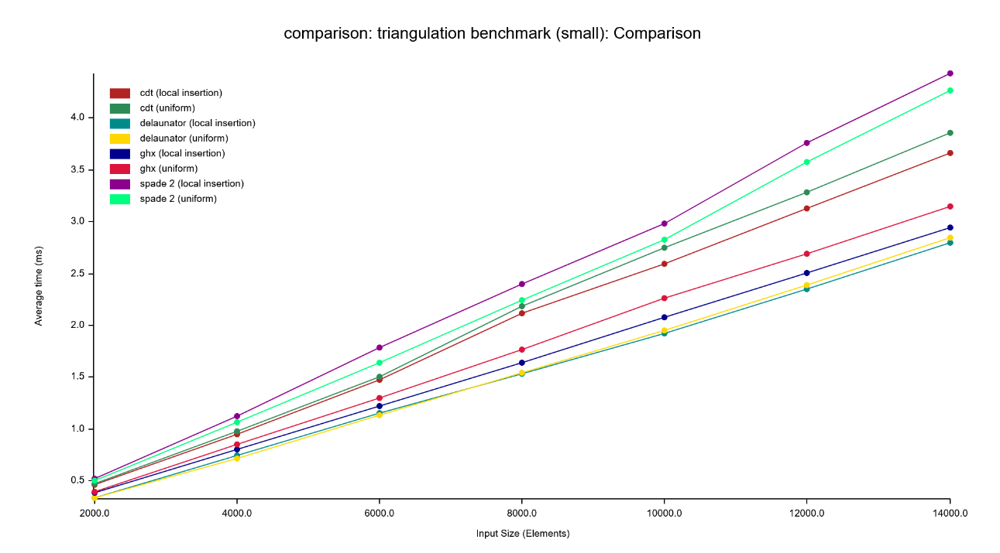

# Benchmarks

Small benchmark suite for comparing different (constrained) Delaunay triangulation implementations in rust, modified from the [spade](https://github.com/Stoeoef/spade/tree/master/delaunay_compare) crate comparison benchmark.

#### Crates tested

| Crate                                                                                   | DT   | CDT  |
| :-------------------------------------------------------------------------------------- | :--- | :--- |
| [delaunator 1.0.1](https://crates.io/crates/delaunator)                                 | Yes  | No   |
| [cdt 0.1.0](https://crates.io/crates/cdt)                                               | Yes  | Yes  |
| [spade 2.0](https://crates.io/crates/spade)                                             | Yes  | Yes  |
| [ghx_constrained_delaunay 0.1.0]("https://github.com/Henauxg/ghx_constrained_delaunay") | Yes  | Yes  |

## Constrained Delaunay triangulation (CDT) measures

This benchmark bulk loads mutliple real data set (shapefiles):
- **ne_50m_coastline**: 60416 vertices, 58987 constraint edges
- **ne_10m_coastline**: 410957 vertices, 406824 constraint edges
- **Europe_coastline**: 2912812 vertices, 2837094 constraint edges

Run it with `cargo run --release --example real_data_benchmark` in the `benchmarks` directory.

### Results

The dataset is both loaded with constraint edges and without (as if it was a regular Delaunay triangulation).


| ne_50m_coastline.shp     | ghx_constrained_delaunay | Spade | cdt crate |
| ------------------------ | ------------------------ | ----- | --------- |
| Without constraint edges | **18ms**                 | 23ms  | 20ms      |
| With constraint edges    | **22ms**                 | 30ms  | 33ms      |
| With stable vertex order | -                        | 39ms  | -         |

| ne_10m_coastline.shp     | ghx_constrained_delaunay | Spade | cdt crate |
| ------------------------ | ------------------------ | ----- | --------- |
| Without constraint edges | **124ms**                | 176ms | 202ms     |
| With constraint edges    | **173ms**                | 233ms | -         |
| With stable vertex order | -                        | 356ms | -         |

| Europe_coastline.shp     | ghx_constrained_delaunay | Spade  | cdt crate |
| ------------------------ | ------------------------ | ------ | --------- |
| Without constraint edges | **879ms**                | 1548ms | 4702ms(*) |
| With constraint edges    | **1377ms**               | 1926ms | 2026ms    |
| With stable vertex order | -                        | 3109ms | -         |

_Results obtained on an i7-14700KF CPU @ 3.40GHz, date: 21/07/2024_

*The benchmark also includes a stable bulk load variant for spade that keeps the relative vertex order consistent*

(*) It seems weird that the `cdt` crate takes **less** time with constraints than without on this specific dataset. I need to look at the implementation.


## Delaunay triangulation (DT) measures

Two point distributions are tested:
 - **uniform**: `f64` coordinates are uniformly distributed in a given interval
 - **local insertion**: consecutive input points are located close to each other. A point is generated by adding a random step (with a fixed maximum length) to the last inserted point (random walk). This creates a more skewed input set.

Run it with ```cargo bench``` in the `benchmarks` directory.

Results are stored in `<repository_root>/target/criterion`.

### Results

For better comparability, measurements are grouped in point sets with less than 14000 vertices ("small") and more than 50000 vertices ("big").

<p align="center"></p>
<p align="center"></p>

_Results obtained on an i7-14700KF CPU @ 3.40GHz, date: 26/07/2024_

## Credits

See the [spade](https://github.com/Stoeoef/spade) crate for the original benchmark.

## Differences with the original benchmark

- Added the [ghx_constrained_delaunay]("https://github.com/Henauxg/ghx_constrained_delaunay") crate.
