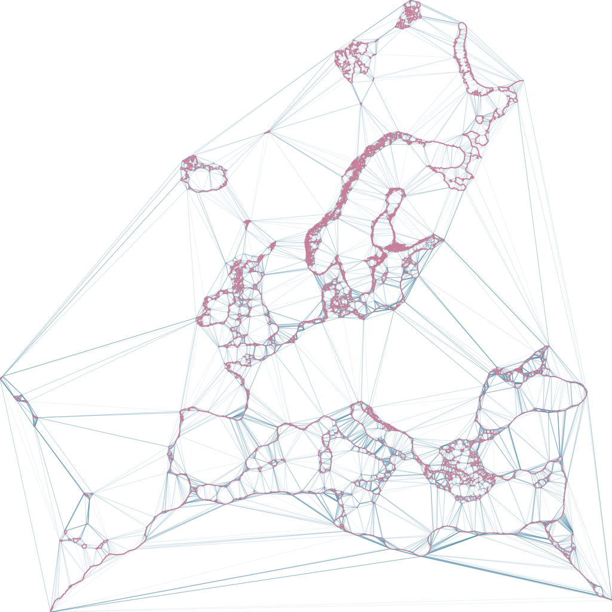

# delaunay_compare

Small benchmark suite for comparing different (constrained) Delaunay triangulation implementations in rust, cloned from the [spade](https://github.com/Stoeoef/spade/tree/master/delaunay_compare) crate comparison benchmark.

## Crates under test

 - [delaunator 1.0.1](https://crates.io/crates/delaunator)
 - [cdt 0.1.0](https://crates.io/crates/cdt)
 - [spade 2.0](https://crates.io/crates/spade)

For spade: Both insertion *with* a lookup structure ("hierarchy") and *without* are being tested.
The look up structure allows efficient position lookup (e.g. for nearest neighbor searches) on the resulting triangulations but takes additional time to construct.

For spade and cdt: This benchmark suite also contains a constrained Delaunay triangulation (CDT) benchmark that bulk loads a single real data set
(Europe_coastline.shp) consisting of 2,912,812 input vertices and 2,837,094 constraint edges.

## Point distributions under test

Two point distributions are tested:
 - **uniform**: `f64` coordinates are uniformly distributed in a given interval
 - **local insertion**: consecutive input points are located close to each other. A point is generated by adding a random step (with a fixed maximum length) to the last inserted point (random walk). This creates a more skewed input set.

 ## How to run

 Clone this repository and run `cargo bench` inside the `delaunay_compare` folder.

 Results are stored in `<repository_root>/target/criterion`.

 For the cdt loading benchmark, run `cargo run --release --example real_data_benchmark`

# Results

For better comparability, measurements are grouped in point sets with less than 14000 vertices ("small") and more than 50000 vertices ("big").

## CDT bulk loading

The CDT bulk loading uses real world data consisting of roughly 2.9e6 input vertices and 2.8e6 input constraint edges:

### CDT Loading times

For completeness, the dataset is both loaded with constraint edges and without (as if it was a regular Delaunay
triangulation).

The benchmark also includes the stable bulk load variant for spade that keeps the relative vertex order consistent.

| CDT Bulk load            | Spade  | cdt crate |
| ------------------------ | ------ | --------- |
| With constraint edges    | 3668ms | 4032ms    |
| Without constraint edges | 2897ms | 5668ms    |
| With stable vertex order | 6502ms | -         |

# Credits

See the [spade](https://github.com/Stoeoef/spade) crate for the original benchmark. It was modified here to include results from `ghx_constrained_delaunay`.